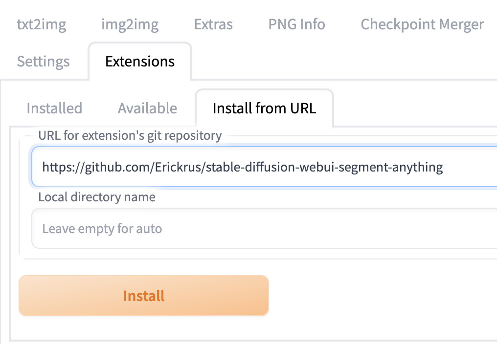

# An extension for stable-diffusion-webui that segment the image elements

[中文版说明](https://github.com/Erickrus/stable-diffusion-webui-segment-anything/blob/main/README_zh.md)

## Installation

### Install dependencies

```shell
pip3 install opencv-python matplotlib onnx onnxruntime
pip3 install 'git+https://github.com/facebookresearch/segment-anything.git'
```

ensure pytorch>=2.0.0

### Install extension from webui

Go to `Extensions` Tab, Click `Install from URL`, Input `https://github.com/Erickrus/stable-diffusion-webui-segment-anything`, Click `Install`



Please restart webui, after the script is installed


## How to use

Upload the image to segment, draw/click tiny point(s) on the left side image and click segment button.

Please make sure the brush radius is around **5**. Dont use large radius as they wont work.


